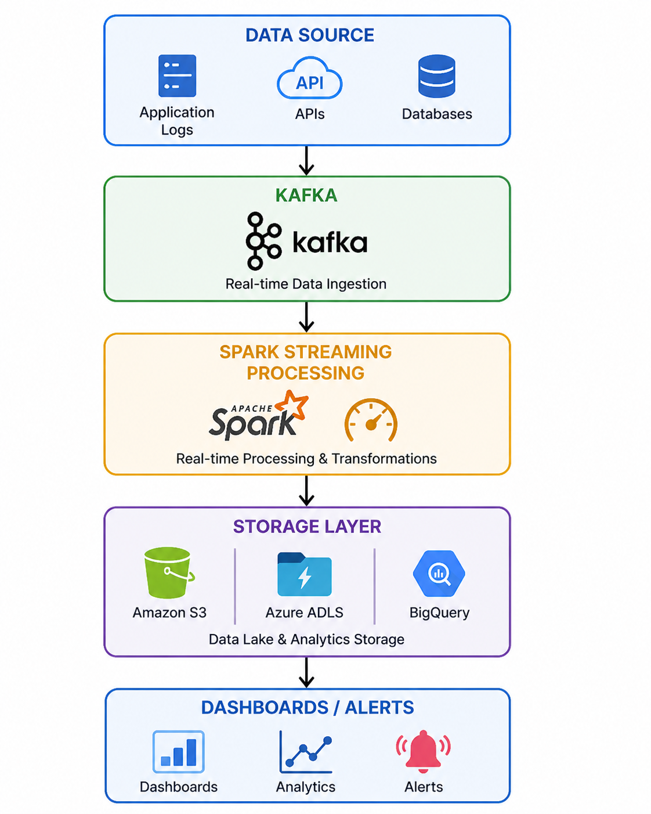

# Real-Time Streaming Data Pipeline (Kafka + Spark)

## Overview
This project focuses on designing a real-time, event-driven data pipeline for low-latency processing and scalable streaming analytics.

Unlike batch-oriented systems, this architecture is optimized for continuous data ingestion, real-time transformations, and immediate downstream consumption.

---

## Architecture Flow

1. Data Sources:
   - Application logs, user events, transactions

2. Ingestion Layer:
   - Apache Kafka (distributed event streaming platform)
   - Topic partitioning for scalability

3. Processing Layer:
   - Spark Structured Streaming
   - Real-time transformations, aggregations, filtering

4. Storage Layer:
   - Data Lake (AWS S3 / Azure ADLS)
   - BigQuery for analytics and querying

5. Consumption Layer:
   - Dashboards (Power BI / Tableau)
   - Alerts / Monitoring systems

---

## Streaming-Specific Design Concepts

- **Event-driven architecture**
  Enables continuous processing of streaming data

- **Low-latency processing**
  Designed to minimize delay between ingestion and consumption

- **Checkpointing**
  Ensures fault tolerance and recovery in case of failures

- **Windowing (Tumbling / Sliding)**
  Supports real-time aggregations over time intervals

- **Exactly-once processing**
  Prevents duplicate data during failures or retries

---

## Key Design Decisions

- Kafka selected for high-throughput, distributed ingestion
- Spark Structured Streaming for unified batch + streaming processing
- Storage layer decoupled to support scalability and replayability
- Partitioning strategy applied to improve performance and parallelism

---

## Technology Stack

- Kafka
- Apache Spark (Structured Streaming)
- PySpark
- AWS S3 / Azure ADLS / BigQuery
- BI Tools (Power BI / Tableau)

---

## Architecture Diagram

---

## Outcome

- Enables near real-time data processing and analytics
- Supports scalable event-driven workloads
- Improves system responsiveness and monitoring capabilities
